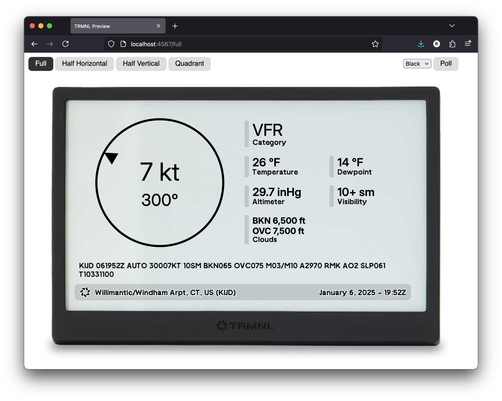

# trmnlp

A basic self-hosted web server to ease the development and sharing of [TRMNL](https://usetrmnl.com/) plugins.

[Liquid](https://shopify.github.io/liquid/) templates are rendered leveraging the [TRMNL Design System](https://usetrmnl.com/framework). They may be generated as HTML (faster, and a good approximation of the final result) or as BMP images (slower, but more accurate).

The server watches the filesystem for changes to the Liquid templates, seamlessly updating the preview without the need to refresh.



## Creating a Plugin

This is the structure of a plugin repository.

```
views/
    full.liquid
    half_horizontal.liquid
    half_vertical.liquid
    quadrant.liquid
config.toml
.env
```

See [config.example.toml](config.example.toml) for an example config.

The [trmnl-hello](https://github.com/schrockwell/trmnl-hello) repository is provided as a jumping-off point for creating new plugins. Simply fork the repo, clone it, and start hacking.

## Running the Server (Docker)

```sh
docker run \
    -p 4567:4567 \
    -v /path/to/plugin/on/host:/plugin \
    schrockwell/trmnlp
```

## Running the Server (Local Ruby)

Prerequisites:

- Ruby 3.x
- For BMP rendering (optional):
  - Firefox
  - ImageMagick

In the plugin repository:

```sh
gem install trmnl_preview
trmnlp serve                # Starts the server
```

You can also run the server from another directory using a subshell:

```sh
(cd path/to/plugin && trmnlp serve)  # Returns to original directory when done
```

## Usage Notes

When the strategy is "polling", the specified URL will be fetched once, when the server starts.

When the strategy is "webhook", payloads can be POSTed to the `/webhook` endpoint. They are saved to `tmp/data.json` for future renders.

## `config.toml` Reference

- `strategy` - Either "polling" or "webhook"
- `url` - The URL from which to fetch JSON data (polling strategy only)
- `live_render` - Set to `false` to disable automatic rendering when Liquid templates change (default `true`)
- `[polling_headers]` - A section of headers to append to the HTTP poll request (polling strategy only)

## Optional `.env`

You can create a `.env` file in your plugin directory to store sensitive information like API keys. This file should never be committed to version control.

Example `.env`:
```bash
# Environment variable names:
# - MUST use UPPER_CASE with underscores
# - Must NOT contain hyphens (-)
# - Must NOT use quotes around values

# Good examples:
API_KEY=your-secret-key
AUTH_TOKEN=Bearer abc123
TRMNL_SECRET=your-value

# Bad examples:
# Api-Key=value        # No hyphens allowed in names
# AUTH_TOKEN="value"   # No quotes around values
# auth_token=value     # Use UPPER_CASE
```

These values can be referenced in your `config.toml` using the `{token}` syntax:

```toml
[polling_headers]
x-api-key = "{API_KEY}"        # Hyphens are fine in header names
authorization = "{AUTH_TOKEN}"  # Token names are case-insensitive
```

The values from `.env` will be used to replace the tokens in your config. The token matching is case-insensitive, so `{API_KEY}` and `{api_key}` will both work.

## Contributing

Bug reports and pull requests are welcome on GitHub at https://github.com/schrockwell/trmnl_preview.

## License

The gem is available as open source under the terms of the [MIT License](https://opensource.org/licenses/MIT).
